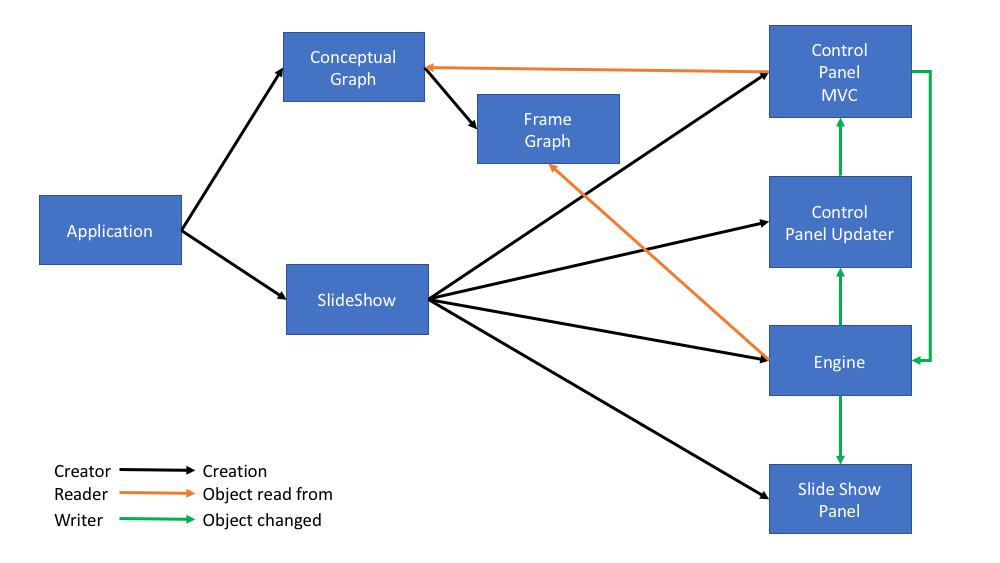
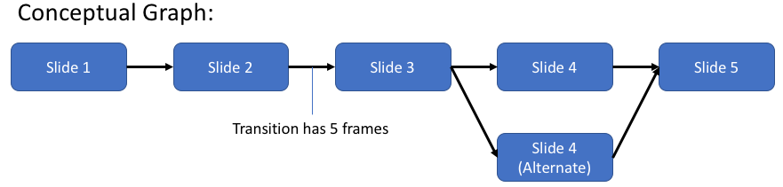
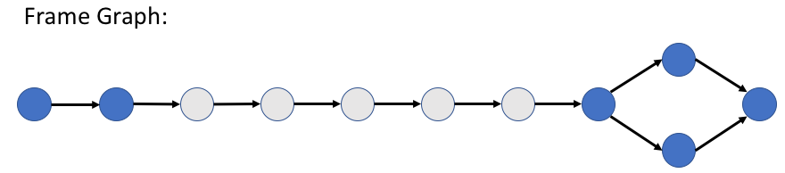
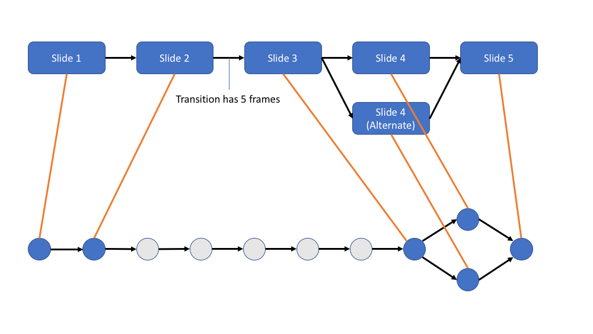
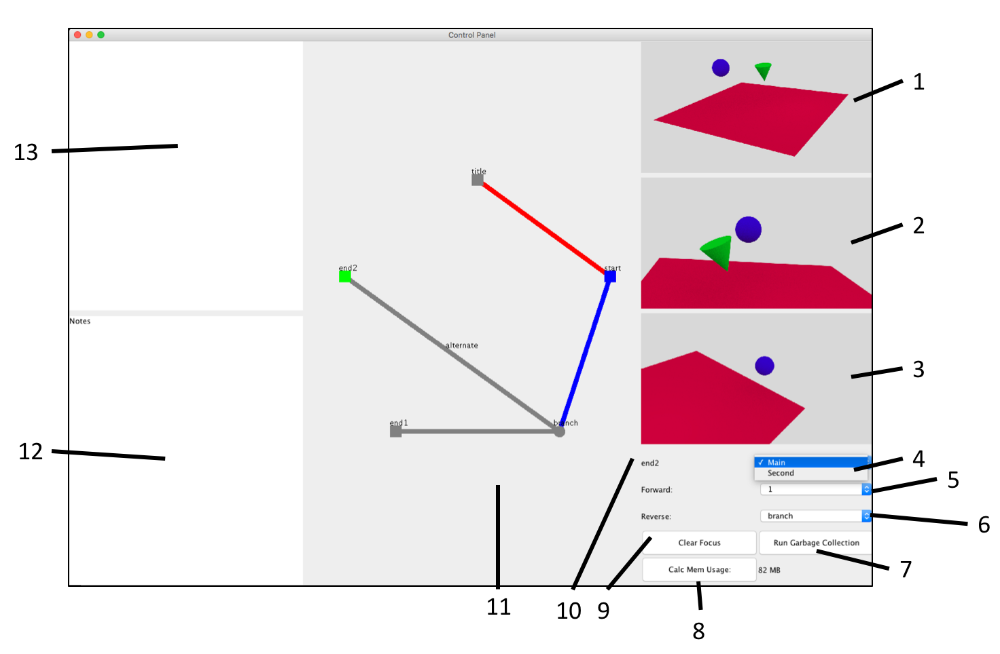

# FancySlideShow
Play slides with more dynamic behavior and interactivity

## Table of Contents ##

[Overview](#overview) 

[Classes](#classes) 

[Usage](#usage) 
- [Control Panel](#control_panel) 
- [Controls](#controls) 

[FrameScripts](#fs)
- [XML Interface](#xml) 
- [Running FrameScripts](#running) 

<a name="overview"/>

# Overview #

This program allows you to arrange a collection of pictures into a presentation.
The advantage of this program over other PowerPoint-like software is that
you can have non-linear flow between slides.
This also provides a seamless interface between movies and slides.

For example, say I have an animation comprised of 1000 rendered pictures and
I want frames 1, 250, and 1000 to be slides.
This program can let you define these slides
then use frames 2-249 as a transition between the first two slides
and frames 251-999 as a transition between the final two slides.
This prevents the awkward slide-to-movie-to-slide artifacts that PowerPoint gives.

See the demo directory for a simple example.

<a name="classes"/>

# Classes #



### Application ###

This is where `main()` lives.
`main()` is responsible for generating a `ConceptualGraph`
and giving it to a `SlideShow`.
`SlideShow.run()` takes care of the rest.
The primary application is called FrameScripts,
and is described [below](TODO).

Some applications are tailor-made for specific slide shows.
This got tedious, so I made the FrameScript application that
takes in an XML script and parses it into a `ConceptualGraph`
(there is more info on the XML interface below).
Thanks to this, you do not need to write a new application
every time you want to make a new presentation.

A typical main method would look something like:
```c++
ConceptualGraph graph = myGraphCreationProcess();//create this graph however you want
SlideShow ss = new SlideShow( graph );
ss.run();
```

### Conceptual Graph ###



This graph is meant to be the user-facing representation of the slide show.
Each node in the graph represents a slide and each edge represents a connection from one slide to another.

#### Conceptual Node ####

The Conceptual Graph has one Conceptual Node for every slide.

At any point, a Conceptual Node can be "hard" or "soft".
Hard Conceptual Nodes pause the engine when they are reached,
while soft nodes are not stopped at for longer than a single frame.

Every Conceptual Node has:

|  Type  | Description |
| ------ | ----------- |
| String | Slide Name  |
| String | Slide Notes |
| Int    | Index       |
| Int    | FrameSpace (a.k.a. Subgraph) |
| Bool   | Stores if the slide is currently "hard" |


#### Conceptual Edge ####

TODO

### Frame Graph ###



The Frame Graph is the machine-facing representation of the slide show.
This graph contains a node for every frame in the entire presentation (slides and transitions).
Every node is either primary (shown in blue) or secondary (shown in gray).
Primary nodes map to ConceptualNodes and secondary nodes map to frames in ConceptualEdges, as shown here:



#### Frame Node ####

TODO

#### Frame Edge ####

TODO

### SlideShow ###

TODO

### SlideShowPanel ###

TODO

### Engine ###

TODO

### Control Panel ###

TODO

### Control Panel Updater ###

TODO

<a name="usage"/>

# Usage #

<a name="control_panel"/>

## Control Panel ##

This is the section that is most likely to be out of date by the time you read this.
The control panel is being tinkered with a lot,
but the general format will stay the same.



#### (1) Current Slide ####

Shows a miniature version of the current slide.

#### (2) Preview of Next Slide ####

If it exists, this shows a miniature version of the next slide.
If the current slide has multiple downstream slides,
only the active one is shown.

#### (3) Selected Slide ####

Shows a miniature version of the current slide.

#### (4) FrameSpace Menu ####

It can be messy to have the graph of the entire presentation shown at once,
so the user can break it up into FrameSpaces.
(11) will only show one FrameSpace at a time and
the user can use this menu to toggle between them.

#### (5) Next Slide Menu ####

This menu lets you scroll over the selected slide's downstream edges and select the active one
(i.e., decide the one that will actually be shown after the selected node).

#### (6) Previous Slide Menu ####

Similar to (5), this menu lets you scroll over the
selected slide's upstream edges and select the active one.

#### (7) Garbage Collection ####

(This is a development feature that will almost certainly be removed)

Java performs garbage collection when this button is pushed.

#### (8) Calc Mem Usage ####

(This is a development feature that will almost certainly be removed)

Java measures the amount of memory it is using
when this button is pushed. The result will be
displayed to the right of the button.

#### (9) Clear Focus ####

(This is a development feature that will almost certainly be removed)

This is not as useful as it used to be.
There used to be some bugs where you could not
click on the control panel because the computer's
focus would be stuck on one of the dropdown menus.
If that happens to you, just push this button and
the focus will go back to its neutral state.

Now that I think about it,
this still might be required after you type in (12).

#### (10) Title of Selected Slide ####

#### (11) Conceptual Graph of Selected FrameSpace ####

A stunningly beautiful illustration of the
FrameSpace selected by (4).

The first slide is at the 12:00 position
and each successive slide (ConceptualNode) in the FrameSpace
is laid out in a clockwise pattern with lines
representing ConceptualEdges.
ConceptualEdges that span two different FrameSpaces
are not shown at this time; I am currently 
debating how I want to portray them.

If provided, names are shown for each
ConceptualNode and ConceptualEdges.
Soft ConceptualNodes are shown as circles
and hard ones are shown as squares.

This graph is interactive,
and the controls are listed below.

#### (12) Runtime Notes ####

This is a text field for you to take notes in.
At the end of the presentation,
these notes will be printed to the console so that you do not lose them.

A possible future feature is for these notes to be emailed to you.

#### (13) Notes for Current Slide ####

Each slide has the ability to hold notes.
If the current slide has notes in it,
they will be displayed here.

<a name="controls"/>

## Controls ##

#### Space Bar ####

Pauses the slide show by stopping the timer.
Every element is still active,
but the engine will stop traversing the
FrameGraph and updating the SlideShowPanel.

If already paused, the space bar resumes
the slide show by starting the timer again.

#### Left Mouse Button (on the ConceptualGraph) ####

Selects a ConceptualNode.

#### Right Mouse Button (on the ConceptualGraph) ####

Toggles the hardness of a ConceptualNode.

#### Left Arrow Key + Shift (optional) ####

Okay this one is tricky due to a few conditionals,
but I assure you that the behavior is reasonable.
In general, the left arrow key means "go backwards".
The details of this depend on the state of the engine.

It's hard to explain in English,
maybe the code can help make it clear:

```c++
private void leftButton( boolean shift ) {
    final boolean was_reversed = engine_.reverse();
    engine_.setReverse( true );

    if( !engine_.isWaitingAtHardNode() && !was_reversed ) {
        //If we were running forward, then all we want to do is turn on reverse
        return;
    }

    if( engine_.getTimer().isRunning() ) {
	//If we are waiting at a hard node, override the hardness
        if( engine_.isWaitingAtHardNode() ) {
            engine_.goAtNextTick();
        }

	//If shift is selected, do not proceed to the active FrameNode
	//Instead, take the highest-ranking non-active FrameNode
        engine_.takeNextSecondaryOption( shift );
    } else {
        //If the timer is stopped, just go back to the previous FrameNode.
        engine_.goBackOneImage();
    }
}
```

#### Right Arrow Key + Shift (optional) ####

The exact symmetric opposite of the left arrow key.
In general, this key means "go forward".

<a name="fs"/>

# FrameScripts #

<a name="xml"/>

## XML Interface ##

TODO

<a name="running"/>

## Running FrameScripts ##

From the top-level directory of this repo:

```sh
run/frame_scripts.sh <xml files>
```